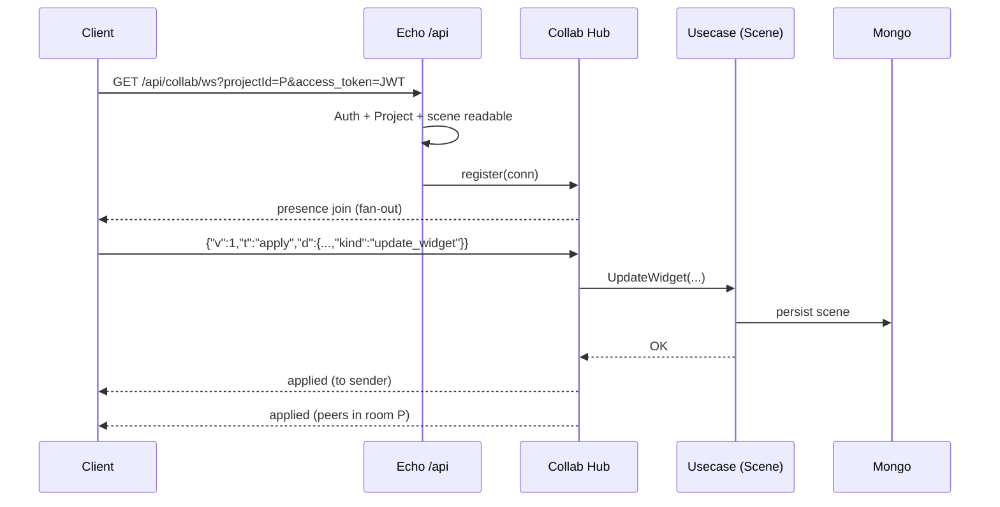

# Real-Time Collaboration — Protocol & Boundaries (MVP)

## Document Signature

|           |        |
| --------- | ------ |
| Creator   | —      |
| Leader    | —      |
| Task Link | [TASK.md](../../TASK.md), [PLAN.md](../../PLAN.md) |
| Developer | —      |

## Background / Problem Statement

Re:Earth Visualizer must support multiple users working on the same project with clear security boundaries and a path toward full TASK.md scope (OT/CRDT, history, GraphQL). **Phase 0** in [PLAN.md](../../PLAN.md) requires a written contract before expanding behavior.

**Facts**

- Collab today uses a **dedicated** authenticated WebSocket: `GET /api/collab/ws?projectId=…` (same private `/api` auth as GraphQL).
- Messages are **JSON v1** with fields `v`, `t`, `d` (see below).
- Domain writes go through existing **usecase interactors** (e.g. `Scene.UpdateWidget`), not ad-hoc Mongo patches from the socket layer.

## Goals

1. Record the **transport choice** and rationale (hybrid: collab on dedicated WS; GraphQL subscriptions out of scope for MVP).
2. Document the **current wire protocol** and extension rules.
3. State the **synchronization model** for MVP vs later OT/CRDT phase.
4. Sketch **persistence** for chat (implemented), **apply audit** append-only (implemented), and future **operation log / undo** (partial).
5. Provide a **security checklist** aligned with production.

## Non-Goals

- Full OT/CRDT merge semantics for layers/styles/scene/storytelling (Phase 3).
- GraphQL subscription schema and `graphql-ws` wiring (Phase 8).
- Multi-user undo journal implementation (Phase 6).

## Solution — Transport

| Option | Description | Decision |
|--------|-------------|----------|
| A | Dedicated Echo + `gorilla/websocket` endpoint | **Chosen** — full control over framing, rate limits, and auth at upgrade. |
| B | GraphQL subscriptions on gqlgen `transport.Websocket` | Deferred — Apollo client today is HTTP-only for GQL; adding subscription transport is a separate client + schema effort. |

**Hybrid (recommended in PLAN):** domain collab + chat on **separate WS**; optional later duplication of thin events via GQL subscription if product requires it.

## Solution — Wire protocol (v1)

Every client message is a JSON object:

| Field | Type | Meaning |
| ----- | ---- | ------- |
| `v`   | int  | Protocol version; must be `1`. |
| `t`   | string | Message type (see table). |
| `d`   | object | Type-specific payload; may be omitted for types that carry no body. |

**Inbound types (`t`)** (non-exhaustive; unknown types are rejected server-side):

| `t` | Role |
| --- | ---- |
| `ping` | Keep-alive; server responds with `pong`. |
| `relay` | Opaque fan-out (escape hatch). |
| `apply` | Server-authoritative mutation; `d.kind` ∈ `update_widget`, `add_widget`, `remove_widget`, `move_story_block`, `create_story_block`, `remove_story_block`, `create_story_page`, `remove_story_page`, `move_story_page`, `update_story_page`, `duplicate_story_page`, `add_nls_layer_simple`, `remove_nls_layer`, `update_nls_layer`, `update_nls_layers`, `add_style`, `update_style`, `remove_style`, **`update_property_value`** (single field/value on a scene-linked **Property** via `Property.UpdateValue`; bumps **scene** revision) (scene writes via interactors). |
| `lock` | Object lock acquire/release/heartbeat. |
| `chat` | Room chat; persisted when Mongo store is configured. |
| `cursor` | Normalized pointer position for presence. |
| `activity` | Lightweight hints (`typing`, `move`). |

**Outbound types** include: `pong`, `presence`, `lock_changed`, `lock_denied`, `chat`, `cursor`, `activity`, `applied`, `error`.

`applied.d` includes **`sceneRev`** (Unix ms from `scene.UpdatedAt()` after persist) so clients can refetch or reconcile local state after reconnect.

**Future envelope fields** (not required in v1; reserved for Phase 2+): `seq`, `clientId`, explicit `roomId` in body (today room is implied by connection query `projectId`).

Limits (configurable via `REEARTH_COLLAB_*` env, see `server/internal/app/config/config.go`): max message bytes, messages/sec per connection, chat runes + min interval, cursor/activity intervals.

## Solution — Synchronization model

| Period | Model |
| ------ | ----- |
| **MVP (Phases 1–2)** | **Server-authoritative operations:** client sends `apply` with a small declarative payload; server validates `Operator`, runs one interactor call, persists via existing repos; on success broadcasts `applied` (+ optional UI toasts on peers). |
| **Later (Phase 3)** | Introduce **OT or CRDT** per entity family after lock integration; rejected ops return structured errors for client rollback. Choice documented here: **decision deferred** until scene JSON size and conflict patterns are measured; default bias in PLAN is tree-shaped **operations** + server normalization, with CRDT evaluation for heavy JSON properties. |
| **Now (Phase 3 slice)** | On `apply` failure (`apply_failed`, `object_locked`, validation codes, …), the **sender** should reconcile with the server: the web editor refetches **GetScene** (`network-only`) when the collab channel receives matching `error` frames; optional toasts for `apply_failed` / `object_locked`. Full OT/CRDT for other entities remains future work. |
| **Coarse revision guard** | Optional `baseSceneRev` on each `apply` body (client = last known `scene.updatedAt` ms). Server rejects with `stale_state` when it does not match current scene row — **not** a CRDT merge; pairs with lock UI and refetch. |
| **Storytelling** | `apply` kinds: blocks — **`move_story_block`**, **`create_story_block`**, **`remove_story_block`**; pages — **`create_story_page`**, **`remove_story_page`**, **`move_story_page`**, **`update_story_page`**, **`duplicate_story_page`** (same auth/audit/`applied`/`sceneRev` path as widgets). |
| **NLS layers** | **`add_nls_layer_simple`**, **`remove_nls_layer`**, **`update_nls_layer`**; batch reorder / multi-field — **`update_nls_layers`** (one `baseSceneRev` check; multiple `NLSLayer.Update` calls; optional **layer** collab-lock, same `applied` / `sceneRev` path). |
| **Layer styles (scene `Style`)** | **`add_style`**, **`update_style`**, **`remove_style`** (interactors `Style.*`; optional collab-lock **`resource: "style"`** + `styleId`). |
| **Property field values (scene-linked)** | **`update_property_value`** — `propertyId`, `fieldId`, `type`, optional `value`, `schemaGroupId`, `itemId`; same revision guard / `applied` / `sceneRev` as other applies; no CRDT merge on arbitrary JSON. |
| **GraphQL-style streaming** | **`GET /api/collab/scene-rev/stream?sceneId=`** (SSE) emits new `sceneRev` after applies (hub-local). See [collab production deploy](../collab-production-deploy.md). |
| **Mentions “push”** | Outbound WS **`notify`** with `d.kind=chat_mention` to tabs whose `userId` equals a parsed `@handle` (in-room only; not FCM/email). |

**Atomicity:** One `apply` message maps to one interactor invocation **except** `update_nls_layers`, which performs several `NLSLayer.Update` calls in order under a single revision guard and one `applied` broadcast; failure returns `error` to sender and does not broadcast `applied`.

## Solution — Persistence

| Data | Collection / store | Status |
| ---- | -------------------- | ------ |
| Chat messages | Default `collabChatMessages` (`REEARTH_COLLAB_CHAT_COLLECTION`); fields `_id`, `projectId`, `userId`, `text`, `ts`, optional `mentions` (string array, parsed from `@handle`); index `{ projectId: 1, ts: -1 }` | Implemented |
| Apply audit (successful `apply` journal) | Default `collabApplyAudit` (`REEARTH_COLLAB_APPLY_AUDIT_COLLECTION`); fields `_id`, `projectId`, `userId`, `kind`, `sceneRev`, `sceneId`, `widgetId`, `ts` (ms); index `{ projectId: 1, ts: -1 }` | **Append + read REST** (Phase 6 slice): `GET /api/collab/apply-audit?projectId=&limit=` (newest first) |
| Collab operation log (undo groups, compensating ops, UI history) | TBD / extension of apply audit | **Not implemented** (full Phase 6) |

REST: `GET /api/collab/chat?projectId=&limit=` and `GET /api/collab/apply-audit?projectId=&limit=` — same access checks as WS (`Operator` + project + `IsReadableScene`).

## Security checklist

- [x] JWT / session: token via query `access_token` on WS (browser) or `Authorization` on REST chat; Echo uses same operator middleware as `/api/graphql`.
- [x] **Project membership:** `Project.FindActiveById` + `IsReadableScene` at WS upgrade; write paths check `IsWritableScene`.
- [x] **Rate limits:** per-connection messages/sec; chat per-user spacing; cursor/activity throttles.
- [x] **DoS:** max frame size, read limit on WS.
- [ ] **Room isolation pentest** — Phase 10 (no cross-project fan-out bugs).

## Production hardening (Phase 10 — manual / periodic)

Use this as a release gate before widening collab beta.

- [ ] **Room isolation:** two accounts A/B; A connects to `projectId` of B → must fail at WS upgrade or first frame; B cannot inject `apply` for A’s scene via forged `sceneId` in payload (server rejects `scene_mismatch`).
- [ ] **Auth bypass:** unauthenticated `GET /api/collab/chat`, `GET /api/collab/apply-audit`, `GET /api/collab/ws` → 401/403 as implemented.
- [ ] **Redis / multi-instance:** with `REEARTH_COLLAB_REDIS_URL`, two server processes, two browsers on same project → presence, chat, `applied`, and locks still propagate.
- [ ] **Lock TTL:** after `REEARTH_COLLAB_LOCK_TTL_SECONDS` without heartbeat, lock clears and peer can acquire (documented expected delay).
- [ ] **Mongo growth:** `collabApplyAudit` and `collabChatMessages` retention or TTL policy for production (not enforced in OSS build).
- [ ] **Observability:** confirm collab errors appear in logs/traces with `projectId` (no PII in message bodies beyond user ids already in app).

## Sequence — join room → apply → broadcast

## Rollout / References

- Server: `server/internal/collab/`, routes in `server/internal/app/app.go`.
- Web: `web/src/services/collab/`, editor integration under `web/src/app/features/Editor/`.
- Agent context: [AGENTS.md](../../AGENTS.md).
- Production: [collab production deploy](../collab-production-deploy.md).

## Open Questions

1. When to add **scene `rev`** (or etag) for post-reconnect **diff/snapshot** (Phase 2 §4).
2. Whether **graphql-ws** subscription path is needed if WS collab stays primary for years.
